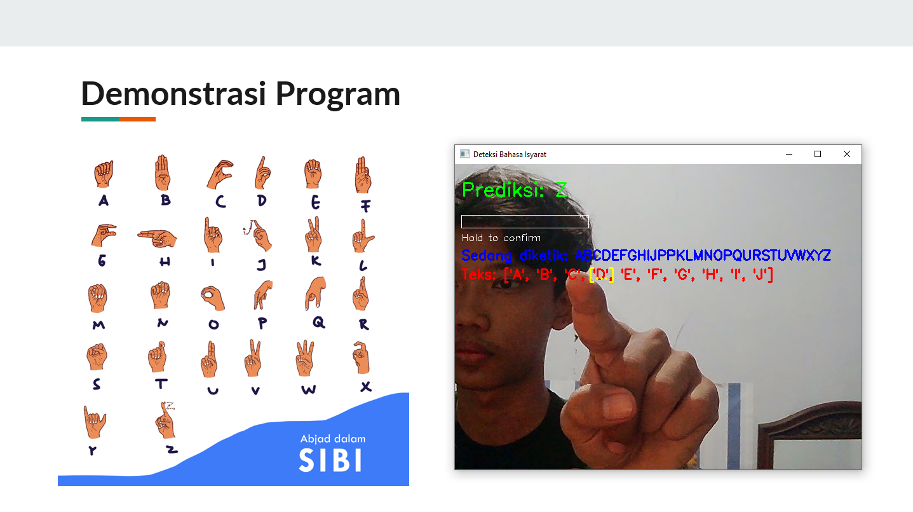

# Real-Time Sign Language Alphabet Translator v1.0.0



### Table of Contents

- [About the Project](#about-the-project)
- [Features](#features)
- [Installation](#installation)
- [Usage](#usage)
- [Roadmap](#roadmap)
- [Fun Fact](#fun-fact)
- [Contact](#contact)

---

### About the Project

This project is a real-time sign language alphabet translator built with Python. It utilizes computer vision to detect hand gestures from a live webcam feed and translates them into text on the screen. The system is powered by a custom-trained Deep Learning model that can recognize the 26 letters of the SIBI (Sistem Isyarat Bahasa Indonesia) alphabet.

The core of this project involves three main stages:
1.  **Preprocessing**: Hand landmarks are extracted from a custom image dataset using the MediaPipe library.
2.  **Model Training**: A Sequential Neural Network is built and trained using TensorFlow and Keras to classify the hand landmarks into corresponding letters.
3.  **Real-Time Detection**: The trained model is deployed in an application that uses OpenCV to capture video, detect gestures, and translate them into a coherent sentence.

---

### Features

-   **Real-Time Hand Detection**: Uses MediaPipe for high-fidelity hand tracking.
-   **Alphabet Recognition**: Classifies 26 distinct hand gestures for each letter of the alphabet.
-   **Interactive Text Generation**:
    -   **Hold to Confirm**: Users must hold a gesture for 1.5 seconds to confirm a letter, preventing accidental inputs.
    -   **Pause for Space**: Removing the hand from the camera view for 1.5 seconds automatically adds a space.
-   **User Controls**: Simple keyboard controls to reset text ('r'), scroll through long text ('a'/'d'), and quit ('q').

---

### Installation

1.  Clone the project from GitHub into your local directory.
    ```bash
    git clone [https://github.com/iannn4u/pro_hand-detection.git](https://github.com/iannn4u/pro_hand-detection.git)
    ```
2.  Navigate into the project directory.
    ```bash
    cd pro_hand-detection
    ```
3.  Create and activate a virtual environment.
    ```bash
    python -m venv .
    source Scripts/activate
    ```
4.  Install the required libraries.
    ```bash
    pip install -r requirements.txt
    ```

---

### Usage

The program runs in three sequential steps. Make sure you have your image dataset inside a `dataset` folder, organized by class (e.g., `dataset/A`, `dataset/B`, etc.) before starting.

1.  **Preprocess the Dataset**: This script will extract hand landmarks from your images and save them into a `.npz` file.
    ```bash
    python utils/preprocess.py
    ```
2.  **Train the Model**: This script will use the processed data to train the neural network and save the final model as `.h5`.
    ```bash
    python train_model.py
    ```
3.  **Run the Real-Time Detection**: This is the main application. It loads the trained model and starts the webcam for live translation.
    ```bash
    python detect_realtime.py
    ```

---

### Roadmap

-   [ ] Implement a more user-friendly GUI instead of the basic OpenCV window.
-   [ ] Expand the model to recognize full words or common phrases, not just individual letters.
-   [ ] Deploy the project as a web application to make it accessible without any installation.

---

### Fun Fact

-   This is my first Deep Learning project!
-   The dataset used to train the model was created entirely by myself.

---

### Contact

For contact

-   **Github**: @iannn4u
-   **Email**: alandriansuryatantra@gmail.com

Project link: https://github.com/iannn4u/pro_hand-detection
